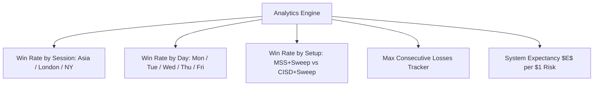

# Quantitative Analytics, Journaling & Optimization Framework (v9.2 Standard)

**Repository:** [`github.com/mch55873-arch/ict-trading`](https://github.com/mch55873-arch/ict-trading)  
**Objective:** Measure Trading Edge ($E$), Parameter Sensitivity, and Session Breakdown  
**Target Asset:** Gold (XAUUSD M5) & FX Majors  

---

## 1. Quantitative Framework Principles

> **Software Engineering $\neq$ Trading Edge.**  
> A clean 10-module FSM architecture guarantees zero repainting, deterministic execution, and low CPU usage. However, **statistical edge** can only be verified through quantitative trade statistics, session analytics, and expectancy formulas.

---

## 2. Statistical Analytics Engine Architecture

The Analytics Engine computes key performance metrics directly on chart during historical backtesting:

### A. Expectancy Formula
$$E = (W \times \text{Average Win}) - (L \times \text{Average Loss})$$
- $W$: Historical Win Rate Percentage
- $L$: Historical Loss Rate Percentage ($100\% - W$)

### B. Multi-Dimensional Breakdown Matrix



---

## 3. Parameter Sensitivity & Optimization Matrix

To optimize system parameters empirically without curve-fitting:

| Parameter Name | Default Value | Test Range | Target Objective |
|---|---|---|---|
| `dispAtrMult` (Displacement) | `1.3` | `1.0` ➔ `2.0` | Maximize Profit Factor while preserving $\ge 50$ trades sample size. |
| `fvgAtrFilter` (FVG Gap Size) | `0.35` | `0.20` ➔ `0.60` | Filter out micro-gaps to reduce false positive rate below $25\%$. |
| `confluenceScore` Threshold | `75%` | `65%` ➔ `85%` | Isolate high-conviction setups to maximize Win Rate ($\ge 65\%$). |
| `eqMinSeparation` (EQH/EQL) | `12 bars` | `8` ➔ `20 bars` | Prevent false liquidity pool tagging on low-volatility ranges. |

---

## 4. Trade Journal Log Specification

For every completed trade, the system formats a structured log line for CSV export / TradingView log output:

```csv
TradeID, Date, Time, Session, Direction, EntryPrice, SLPrice, TP1Price, FinalTP, Result, RiskReward, ConfluenceScore
1, 2026-08-03, 13:45 PKT, London KZ, LONG, 2380.50, 2374.20, 2393.10, 2405.00, CLOSED_TP, 1:3.8, 85%
2, 2026-08-04, 18:15 PKT, NY Open, SHORT, 2395.10, 2401.30, 2382.70, 2370.00, CLOSED_BE, 1:2.0, 75%
```

---

## 5. Verification Roadmap (Sprint 8: QA & Optimization)

- [x] **Module Decoupling:** 10 core modules in `src/` committed and verified.
- [x] **Diagnostic Module:** `src/testing/11_Diagnostic_and_Backtest.pine` deployed.
- [ ] **200-Trade Sample Logging:** Collect manual trade logs across XAUUSD M5 historical chart.
- [ ] **Session Win Rate Audit:** Compare London KZ vs NY Silver Bullet performance.
- [ ] **v9.2 Parameter Refinement:** Lock in optimal ATR displacement and confluence thresholds based on empirical data.
