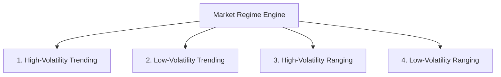

# Quantitative Research & Risk Protocol (v9.3 Standard)

**Repository:** [`github.com/mch55873-arch/ict-trading`](https://github.com/mch55873-arch/ict-trading)  
**Specification Level:** Institutional Quantitative Hedge Fund Standard (v9.3)  
**Primary Focus:** Walk-Forward Optimization, Monte Carlo Simulation, Risk Ratios & Market Regimes  

---

## 1. Walk-Forward & Out-of-Sample Testing Protocol

To avoid **overfitting / curve-fitting**, parameters are validated using rolling walk-forward windows:

```
[Window 1: Jan-Jun (In-Sample Training)]   ──► Validate on [Jul-Aug (Out-of-Sample)]
[Window 2: Feb-Jul (In-Sample Training)]   ──► Validate on [Aug-Sep (Out-of-Sample)]
[Window 3: Mar-Aug (In-Sample Training)]   ──► Validate on [Sep-Oct (Out-of-Sample)]
```

- **Pass Criterion:** Out-of-sample Profit Factor must retain at least **$80\%$ of In-Sample Profit Factor** without exceeding $15\%$ max drawdown.

---

## 2. Monte Carlo Simulation Engine

Simulates **1,000 random trade sequence reshuffles** from historical trade samples to compute risk boundaries:

| Metric | Target Boundary | Description |
|---|---|---|
| **Probability of Ruin ($P_{\text{ruin}}$)** | $< 1.0\%$ | Risk of losing $50\%$ account equity over 100 trades. |
| **95% Confidence Max Drawdown** | $\le 14.5\%$ | 95th percentile worst-case drawdown from 1,000 iterations. |
| **Ulcer Index (UI)** | $< 3.5$ | Measures depth and duration of equity drawdowns. |

---

## 3. Market Regime Classification

Market conditions are dynamically categorized into 4 distinct regimes to evaluate setup robustness:



- **Target Rule:** The ICT Execution Engine must remain positive expectancy ($E > +0.5R$) in at least **3 out of 4 market regimes**.

---

## 4. Advanced Risk & Trade Quality Ratios

### A. Sharpe & Sortino Ratios
- **Sharpe Ratio ($S$):** Measures total risk-adjusted return:
  $$S = \frac{R_p - R_f}{\sigma_p}$$
- **Sortino Ratio ($S_t$):** Filters out upside volatility and penalizes only downside risk:
  $$S_t = \frac{R_p - R_f}{\sigma_d}$$
- **Target:** Sortino Ratio $\ge 2.5$ on XAUUSD M5 historical backtest.

### B. MAE & MFE Excursion Analysis
- **Maximum Adverse Excursion (MAE):** Tracks maximum drawdown price reached during active trades before exit.
- **Maximum Favorable Excursion (MFE):** Tracks peak profit price reached during active trades to optimize Take Profit thresholds.

---

## 5. Statistical Significance & Sample Size Bounds

- **Minimum Sample Requirement:** $N \ge 300$ verified trades across XAUUSD M5, EURUSD M15, and GBPUSD M5.
- **Statistical Significance Goal:** Student's $t$-test $p$-value $< 0.01$ proving trading edge is statistically distinguishable from random walk noise.
