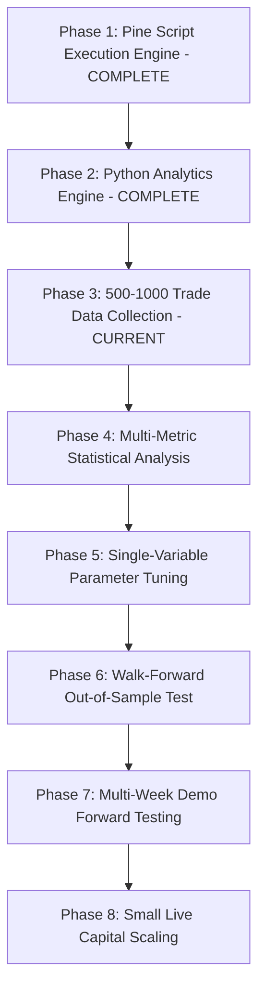

# Institutional Quantitative Research Pipeline (8-Phase Standard)

**Repository:** [`github.com/mch55873-arch/ict-trading`](https://github.com/mch55873-arch/ict-trading)  
**Research Standard:** 8-Phase Quantitative Hedge Fund Pipeline  
**Asset Target:** Gold (XAUUSD M5) & FX Majors  

---

## 1. The 8-Phase Quantitative Research Pipeline



---

## 2. Institutional Execution Protocol

### A. Feature Freeze Directive
- **Rule:** Zero new indicator features or ICT concepts will be added to `PriceActionPro_MEGA_v9.pine`.
- **Rationale:** Simpler systems with high-conviction parameters consistently outperform complex over-engineered indicators.

### B. Single-Variable Optimization Rule
- **Rule:** Never tune multiple parameters simultaneously.
- **Protocol:** Change **exactly one parameter** (e.g. `dispAtrMult` from $1.3$ to $1.5$), collect $500$ trade logs, run `python/journal_analyzer.py`, and compare statistical metrics against the baseline.

---

## 3. Data Collection Target Matrix (Phase 3)

| Asset | Timeframe | Target Trade Count | Session Distribution | Target Metric |
|---|---|---|---|---|
| **XAUUSD** | M5 | $500+$ Trades | London KZ + NY Open + NY Silver Bullet | Expectancy $E > +0.5R$ |
| **EURUSD** | M15 | $250+$ Trades | London KZ + NY Open | Expectancy $E > +0.4R$ |
| **GBPUSD** | M5 | $250+$ Trades | London KZ + NY Open | Expectancy $E > +0.4R$ |

---

## 4. GitHub Verification Commands

To independently verify the local working tree and remote commits on GitHub:

```bash
git log -n 10 --oneline
git status
git ls-files
```
