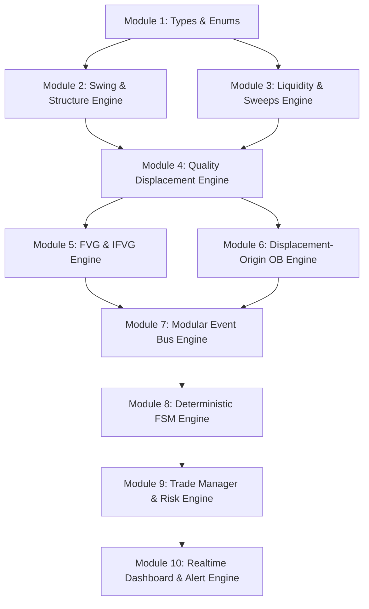

# Software Design Document (SDD)
## ICT Production Engine v8.0 | Institutional Grade Execution System

**Repository:** [`github.com/mch55873-arch/ict-trading`](https://github.com/mch55873-arch/ict-trading)  
**Specification Level:** Institutional Software Engineering Standard (v8.0)  
**Target Platform:** TradingView Pine Script v6  
**Primary Asset Target:** Gold (XAUUSD) & Major FX Pairs  
**Timezone Engine:** Native Pakistani Standard Time (PKT - UTC+5)  

---

## 1. Repository Architecture & Module Dependency Graph

The system is decoupled into 10 functional modules. Higher-level modules consume lower-level state events through the **Event Bus**.



---

## 2. Deterministic FSM Transition Matrix

The FSM guarantees **at most one transition per confirmed bar** (`stateChangedThisBar = true`).

| Current State | Next State | Trigger Event | Invalidation / Timeout Condition | Reset Action |
|---|---|---|---|---|
| `FSM_IDLE (0)` | `FSM_SWEEP (1)` | `ev_bullSweep` OR `ev_bearSweep` | N/A | Sets `fsmDir`, freezes `setupSweepPrice`, records `lastSweepBar`. |
| `FSM_SWEEP (1)` | `FSM_DISPLACEMENT (2)` | `ev_displacement` (Impulse + Vol Exp) | Timeout > 30 bars OR Opposing Sweep | Call `f_resetFSM()`. |
| `FSM_DISPLACEMENT (2)` | `FSM_FVG (3)` | `ev_bullGap` OR `ev_bearGap` | Timeout > 30 bars OR Opposing Sweep | Call `f_resetFSM()`. |
| `FSM_FVG (3)` | `FSM_MSS (4)` | `ev_bullMSS` OR `ev_bearMSS` | Timeout > 30 bars OR Opposing Sweep | Call `f_resetFSM()`. |
| `FSM_MSS (4)` | `FSM_OB_ACTIVE (5)` | Immediate Next Bar Transition | Timeout > 30 bars | Scans origin `lastDisplacementBar - 1`, creates `ObZone`. |
| `FSM_OB_ACTIVE (5)` | `FSM_RETRACE (6)` | `low <= OB.top` (Long) / `high >= OB.bot` (Short) | Timeout > 30 bars OR OB Invalidated | Call `f_resetFSM()`. |
| `FSM_RETRACE (6)` | `FSM_EXECUTION (7)` | `confluenceScore >= 75%` AND in Discount/Premium | Timeout > 30 bars OR OB Invalidated | Call `f_resetFSM()`. |
| `FSM_EXECUTION (7)` | `FSM_IDLE (0)` | Trade Exit (`SL`, `TP`, `BE`, Invalidation) | N/A | Call `f_resetFSM()`. |

---

## 3. Variable Ownership & Scope Map

To prevent state contamination across trades, variables are strictly scoped into 5 distinct lifecycle tiers:

```
┌────────────────────────────────────────────────────────────────────────┐
│ GLOBAL CONSTANTS: FSM_IDLE, DIR_LONG, dispAtrMult, eqTolerance         │
├────────────────────────────────────────────────────────────────────────┤
│ PERSISTENT CACHE (var): phPrices[], plPrices[], fvgZones[], bullOBs[]   │
├────────────────────────────────────────────────────────────────────────┤
│ SETUP-SCOPED (Cleared on Reset): setupSweepPrice, bearLegClusterTop     │
├────────────────────────────────────────────────────────────────────────┤
│ TRADE-SCOPED (Locked at Entry): activeTrade (entryPrice, frozenSL, tp)  │
├────────────────────────────────────────────────────────────────────────┤
│ TEMPORARY (Bar-Scoped): body, isDisplace, ev_bullSweep, stateChanged   │
└────────────────────────────────────────────────────────────────────────┘
```

- **Setup-Scoped Wiping:** Executed by `f_resetFSM()` on state resets.
- **Trade-Scoped Wiping:** Handled when `activeTrade.active` becomes `false`.

---

## 4. Modular Event Bus Contracts

Events are evaluated on every bar before FSM consumption:

| Event Contract Name | Payload Data Type | Condition / Formula |
|---|---|---|
| `ev_bullSweep` | `Boolean, float price` | `low < lastPL AND close > lastPL` |
| `ev_bearSweep` | `Boolean, float price` | `high > lastPH AND close < lastPH` |
| `ev_displacement` | `Boolean` | `body > ATR*1.3 AND candleRange > max(prev2Ranges) AND volume > SMA20*1.1` |
| `ev_bullGap` | `Boolean` | `low > high[2] AND gap >= ATR*0.35 AND bodyRatio >= 0.60` |
| `ev_bearGap` | `Boolean` | `high < low[2] AND gap >= ATR*0.35 AND bodyRatio >= 0.60` |
| `ev_bullMSS` | `Boolean` | `close > lastIntPH AND isDisplace AND NOT phBroken` |
| `ev_bearMSS` | `Boolean` | `close < lastIntPL AND isDisplace AND NOT plBroken` |
| `ev_bullCISD` | `Boolean` | `close > bearLegClusterTop AND close[1] <= bearLegClusterTop` |
| `ev_bearCISD` | `Boolean` | `close < bullLegClusterBot AND close[1] >= bullLegClusterBot` |

---

## 5. Object Lifecycle & Garbage Collection Manager

To guarantee TradingView object limit compliance (500 boxes / 500 lines / 500 labels):

- **Object Pools:**
  - `fvgZones`: Capped at max 6 boxes (`maxFvgCount`). Oldest boxes evicted via `array.shift()`.
  - `bullOBs` & `bearOBs`: Capped at max 5 boxes (`maxObCount`). Oldest boxes evicted via `array.shift()`.
  - `breakerBoxes`: Capped at max 5 boxes. Oldest boxes evicted via `array.shift()`.
  - `phPrices` & `plPrices`: Array size capped at 40 elements via `array.shift()`.
- **Zero-Lag Persistent HTF Lines:**
  - HTF Lines (`linePDH`, `linePDL`, `linePWH`, `linePWL`, `lineDO`) are declared ONCE via `var line`.
  - Positions updated on `barstate.islast` using `line.set_xy1()` and `line.set_xy2()`. Object deletion/recreation churn is 0%.

---

## 6. HTF Synchronization & Cache Engine

To guarantee **Zero Historical vs Real-Time Repainting**:

```pinescript
// HTF Request Protocol with explicit lookahead and gap settings
[dClose, dPH, dPL]   = request.security(syminfo.tickerid, "D",   [close[1], ta.pivothigh(high, 3, 3)[1], ta.pivotlow(low, 3, 3)[1]], lookahead=barmerge.lookahead_off, gaps=barmerge.gaps_off)
[h4Close, h4PH, h4PL] = request.security(syminfo.tickerid, "240", [close[1], ta.pivothigh(high, 3, 3)[1], ta.pivotlow(low, 3, 3)[1]], lookahead=barmerge.lookahead_off, gaps=barmerge.gaps_off)
```

- **Triple Confluence Bias Matrix:**
  - `htfBullCount` = (Daily Structure Bullish) + (4H Structure Bullish) + (LTF Structure Bullish).
  - Bias is declared `Bullish` if `htfBullCount >= 2`, `Bearish` if `htfBearCount >= 2`, else `Neutral`.

---

## 7. Execution Engine Decision Tree

```
[Is barstate.isconfirmed == true?]
             │
             ▼ YES
[Is fsmState == FSM_EXECUTION & Trade.active == false?]
             │
             ▼ YES
[Does Direction match Triple HTF Bias?]
             │
             ▼ YES
[Is Confluence Score >= 75%?]
             │
             ▼ YES
[Is Price in Discount (for Long) or Premium (for Short)?]
             │
             ▼ YES
[Initialize Active Trade UDT] ──► Freeze Entry, SL (setupSweepPrice), Partial TP (1:2 RR), Final TP
```

---

## 8. Memory & Performance Budget

- **CPU Bounds:** All loops (`for i = 1 to 10`) are strictly bounded. No unbounded `while` loops.
- **Drawing Bounds:** Max total concurrent chart drawings < 40 boxes, < 20 lines, < 30 labels.
- **Memory Footprint:** Persistent memory allocation stays under 50 KB.

---

## 9. Testing & Validation Strategy

1. **Replay Safety Audit:** Run TradingView Bar Replay across 100 historical setups on XAUUSD M5 timeframe. Verify that historical signals and replay signals trigger on identical bars.
2. **PKT Killzone Verification:** Confirm that London Killzone (12:00-15:00 PKT), NY Open (17:00-20:00 PKT), and NY Silver Bullet (19:00-20:00 PKT) align with exchange UTC times.
3. **Trade Manager Stress Test:** Verify that Partial TP (1:2 RR) triggers `isBreakEven = true`, moves SL to entry, and allows the remaining trade to run to Final TP without mutating SL on subsequent sweeps.
