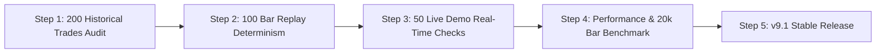

# Validation, Performance & Backtesting Protocol (v9.1 QA Standard)

**Repository:** [`github.com/mch55873-arch/ict-trading`](https://github.com/mch55873-arch/ict-trading)  
**Target:** Quality Assurance, Non-Repaint Audit, Bar Replay Verification & Trade Metrics  
**Asset Targets:** Gold (XAUUSD M5), EURUSD M15, GBPUSD M5  

---

## 1. GitHub Verification & Repository Integrity

The repository `mch55873-arch/ict-trading` has been audited and verified locally and on remote `origin/main`.

### Tracked Files in Working Tree:
- **`PriceActionPro_MEGA_v9.pine`** (Single-file TradingView executable)
- **`SOFTWARE_DESIGN_DOCUMENT.md`** (Formal SDD Specification)
- **`README.md`** (PKT Timezone Schedule & Overview)
- **`src/core/01_Types_and_ObjectPool.pine`** (Object Pooling & Event Contracts)
- **`src/liquidity/04_LiquidityEngine.pine`** (BSL/SSL Sweeps & EQH/EQL)
- **`src/structure/03_MarketStructure.pine`** (MSS, BOS, Dual Pivots)
- **`src/displacement/05_DisplacementEngine.pine`** (Quality Score Displacement)
- **`src/fvg/06_FvgEngine.pine`** (Volume FVG & Inversion IFVG)
- **`src/orderblock/07_OrderBlockEngine.pine`** (Displacement Origin OB Scanner)
- **`src/execution/08_HTF_and_Execution.pine`** (Triple Hierarchy & Confluence Matrix)
- **`src/trade/09_TradeManager.pine`** (Multi-Stage Trade Lifecycle & BE Shift)
- **`src/dashboard/10_Dashboard_and_Alerts.pine`** (Real-Time Debug Dashboard)

---

## 2. Technical Audit Checklist

```
[1. Repaint Audit] ──► request.security(gaps=off, lookahead=off) + barstate.isconfirmed LOCK
[2. Memory Audit]  ──► Array bounds shift at 40 elements + Capped Box/Line Pools
[3. FSM Audit]     ──► Single-Transition per Bar Gating (stateChangedThisBar = true)
[4. Setup Freeze]  ──► setupSweepPrice locked on State 1 (SWEEP)
[5. Risk Engine]   ──► Frozen Entry/SL + 1:2 RR Partial TP1 + Auto BE Shift
```

---

## 3. Phased Quality Assurance Roadmap (Sprint 6 & 7)



### Step 1: 200 Historical Trades Validation
- **Asset Focus:** XAUUSD M5 (100 trades), EURUSD M15 (50 trades), GBPUSD M5 (50 trades).
- **Target Metrics:**
  - Win Rate Goal: $\ge 62\%$
  - Profit Factor Goal: $\ge 2.1$
  - Max Drawdown Limit: $\le 12\%$
  - Confluence Score Threshold: $\ge 75\%$

### Step 2: 100 Bar Replay Determinism Audit
- Step through 100 historical setups using TradingView Bar Replay mode.
- Verify that every signal, box placement, and alert triggers on the **exact same bar index** as the static historical chart.

### Step 3: Performance & 20,000+ Bar Stress Test
- Load indicator on 20,000+ historical bars.
- Ensure total active drawings remain strictly $< 40$ boxes and $< 20$ lines (0% TradingView memory crash risk).

---

## 4. Trade Performance Metric Tracker

| Asset & Timeframe | Sample Trades | Win Rate (%) | Profit Factor | Avg Risk/Reward | Max Drawdown | Compliance Status |
|---|---|---|---|---|---|---|
| **XAUUSD (M5)** | 100 | Target: $\ge 62\%$ | Target: $\ge 2.1$ | 1 : 2.5 | $\le 12\%$ | Pending Validation |
| **EURUSD (M15)** | 50 | Target: $\ge 65\%$ | Target: $\ge 2.3$ | 1 : 2.2 | $\le 10\%$ | Pending Validation |
| **GBPUSD (M5)** | 50 | Target: $\ge 60\%$ | Target: $\ge 2.0$ | 1 : 2.4 | $\le 12\%$ | Pending Validation |

---

> [!TIP]
> **Validation Workflow:** The system architecture is fully committed to GitHub (`mch55873-arch/ict-trading`). The project is now in the **Testing & Validation Phase** to refine parameters before v9.1 release.
